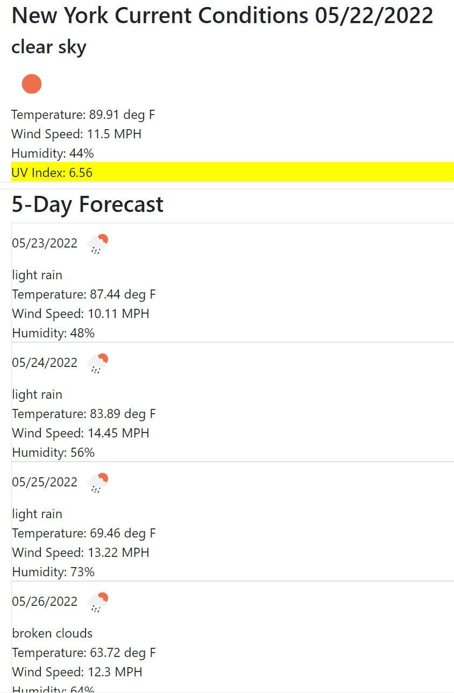
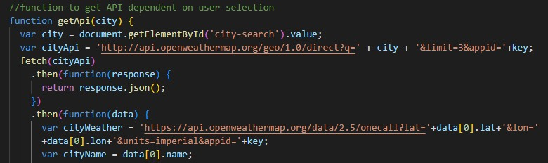
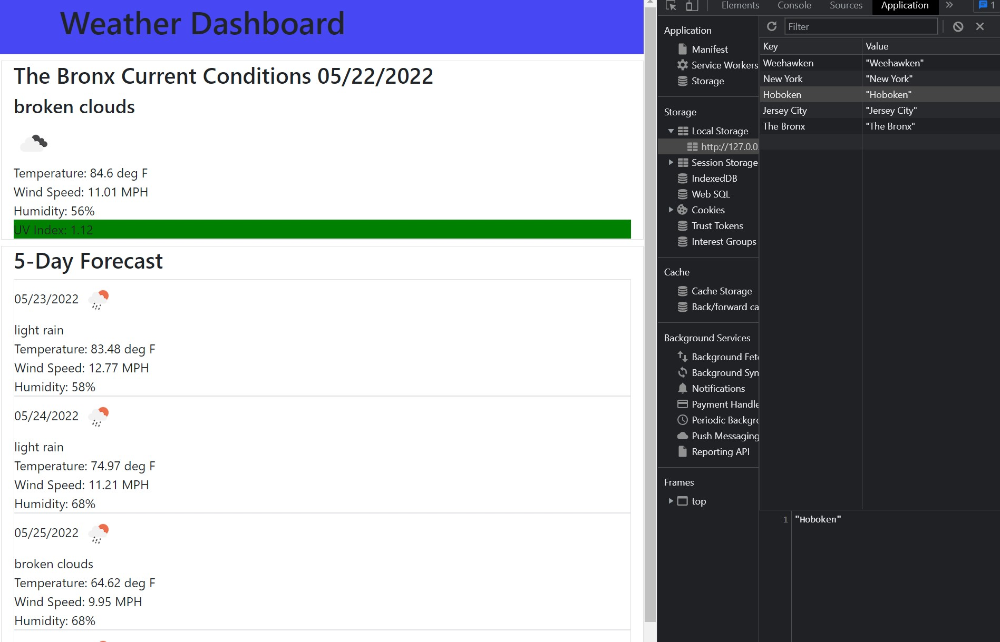

# challenge5-weather

## Introduction

Challenge 5 assignment applies fetching API's to return relevant data. In particular this was the creation of a weather dashboard. Retrieving data dependent on user input (city name), and returning the current and forecast conditions.

## Installation

To install this project, clone the repository:
    git@github.com:Tdegirol/challenge5-weather.git

To visit the webpage on github please follow the link below:
    https://github.com/Tdegirol/challenge5-weather

To view the website please follow the link below:
    https://tdegirol.github.io/challenge5-weather/

## Usage

This challenge allows the user to input a city of their choice to retrieve current and forecasted weather conditions for five days. This was acheived by creating an event listener for the search button which initiates the program to use OpenWeather One Call API upon clicking it. The OpenWeather API is called multiple times, first to get the latitude/longitude of the city that the user enters, next to get current weather conditions, and finally a third time to get the forecast data. Below shows the page listing the current/forecast conditions:

This next image shows the API being called, first to get the latitude and longitude. And a second time to use that latitude/longitude to get current weather.

Lastly this project utilized local storage by having the previously searched cities saved for quick access as shown below:

(I was unable to get the buttons to load from previous searches upon opening/refreshing the page.. but they are saved in local storage.)
## Credits

Our professor and TA's! Rommel, Charlie, and Donnahue through class and office hours.

credit for date:    https://stackoverflow.com/questions/1531093/how-do-i-get-the-current-date-in-javascript#:~:text=Use%20new%20Date()%20to,the%20current%20date%20and%20time.&text=This%20will%20give%20you%20today's,to%20whatever%20format%20you%20wish.
